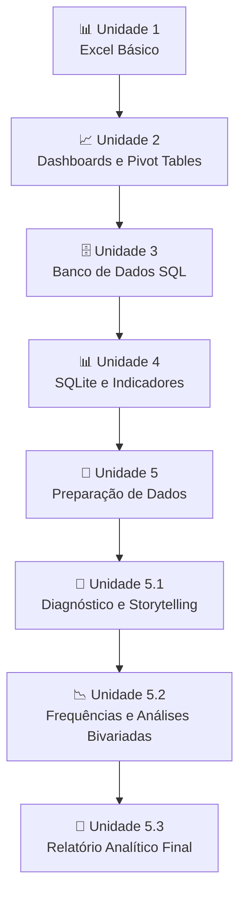

# 🚦📊 Projeto Aponti Academy – Análise, Preparação e Exploração de Dados

Este repositório reúne as atividades desenvolvidas ao longo das **Unidades 1 a 5.3** do programa **Aponti Academy**, abrangendo desde análises iniciais em Excel até preparação de dados, modelagem analítica e construção de diagnósticos baseados em evidências.

O projeto utiliza bases reais, com destaque para os dados de acidentes rodoviários da **Polícia Rodoviária Federal (PRF) – Datatran 2025**, permitindo a aplicação prática de conceitos de:

* 📊 Excel e Google Sheets
* 🗄️ SQL e SQLite
* 🐍 Python (Pandas, NumPy e Matplotlib)
* 📈 Estatística Descritiva
* 📋 Storytelling com Dados
* 🔍 Análise Exploratória de Dados (EDA)
* 📚 Documentação e Boas Práticas Analíticas

---

# 🎯 Objetivo Geral

Transformar dados brutos em informações confiáveis e acionáveis por meio de processos de limpeza, organização, análise e documentação, desenvolvendo competências fundamentais para projetos de Data Analytics e Ciência de Dados.

---

# 📂 Estrutura das Unidades

## 📘 Unidade 1 – Análise Inicial dos Acidentes PRF 2025

### Tema

Análise exploratória inicial da base de acidentes da PRF utilizando Excel.

### Principais Técnicas

* Fórmulas avançadas (`AVERAGEIF`, `PROCV`, entre outras)
* Cálculo de indicadores
* Criação de gráficos comparativos
* Consolidação de dados

### Entregas

* Planilha analítica
* Indicadores de severidade
* Quantidade de sobreviventes
* Identificação de rodovias críticas

---

## 📘 Unidade 2 – Dashboards e Tabelas Dinâmicas

### Tema

Construção de análises visuais e dashboards gerenciais.

### Principais Técnicas

* Pivot Tables
* Gráficos dinâmicos
* Segmentação de dados
* Organização de dashboards

### Entregas

* Dashboard nacional
* Dashboard por município
* Dashboard temporal
* Dicionário resumido da base
* Checklist de qualidade

---

## 📘 Unidade 3 – Missão Escola Tech

### Tema

Modelagem e manipulação de dados acadêmicos utilizando SQL.

### Principais Técnicas

* Importação e tratamento de CSV
* Consultas SQL
* Correção de inconsistências cadastrais
* Operações CRUD

### Comandos Utilizados

```sql
SELECT
INSERT
UPDATE
DELETE
```

### Entregas

* Base acadêmica corrigida
* Relatório em PDF
* Estatísticas de desempenho
* Indicadores de aprovação

---

## 📘 Unidade 4 – Análise dos Acidentes Rodoviários Federais (SQLite)

### Tema

Construção de indicadores analíticos utilizando SQLite.

### Principais Técnicas

* Criação de Views
* Consultas analíticas
* Indicadores de desempenho
* Cálculo de Lift

### Views Desenvolvidas

* `vw_acidentes_base`
* `vw_indicadores_mensais`
* `vw_indicadores_uf_br`

### Entregas

* Indicadores por UF
* Indicadores por BR
* Indicadores por clima
* Indicadores por fase do dia
* Indicadores por tipo de pista
* Indicadores por causa do acidente

---

## 📘 Unidade 5 – Preparação de Dados com Python

### Tema

Construção de bases analíticas e modeláveis para projetos de análise de dados.

### Principais Tecnologias

* Pandas
* NumPy
* Matplotlib

### Técnicas Aplicadas

* Padronização de colunas
* Tratamento de valores nulos
* Remoção de duplicidades
* Criação de atributos derivados
* Controle de Data Leakage

### Variáveis Derivadas

* `acidente_fatal`
* `total_vitimas`
* `indice_gravidade`

### Entregas

#### Base Analítica

Preparada para análises exploratórias e construção de dashboards.

#### Base Modelável

Preparada para algoritmos de Machine Learning e análises preditivas.

#### Documentação

* Dicionário de Variáveis
* Registro das decisões de tratamento
* Relatório metodológico

---

## 📘 Unidade 5.1 – Diagnóstico dos Acidentes Fatais nas Rodovias Federais

### Tema

Investigação dos fatores associados aos acidentes fatais registrados pela PRF em 2025.

### Ferramentas

* Excel
* Google Sheets
* Data Analytics Canvas
* PowerPoint
* Gamma

### Técnicas Aplicadas

* Construção de KPIs
* Cruzamentos dimensionais
* Storytelling com dados
* Formulação e validação de hipóteses

### Dimensões Analisadas

* Unidade Federativa (UF)
* Rodovia (BR)
* Tipo de pista
* Causa do acidente
* Fase do dia
* Condição meteorológica

### Entregas

* Canvas de Hipóteses
* Apresentação Executiva
* Storytelling Analítico
* README metodológico

### Objetivo

Transformar dados operacionais em diagnósticos estratégicos capazes de apoiar ações preventivas e tomadas de decisão.

---

## 📘 Unidade 5.2 – Frequências, Rankings e Análises Bivariadas

### Tema

Análise estatística exploratória da base Datatran 2025 com foco na identificação de padrões de ocorrência, fatores de risco e características associadas à fatalidade dos acidentes.

### Principais Técnicas

* Tabelas de frequência absoluta e relativa
* Rankings de categorias
* Séries temporais simples
* Análises bivariadas
* Cruzamento de variáveis
* Identificação de combinações críticas de fatores

### Indicadores Avaliados

* Municípios com maior número de acidentes
* Principais causas dos acidentes
* Tipos de acidente
* Classificação das ocorrências
* Tipo de pista
* Traçado da via
* Uso do solo
* Condições meteorológicas
* Evolução mensal dos indicadores

### Análises de Fatalidade

Foram investigadas variáveis associadas ao aumento do risco de morte:

* Estados com maiores taxas de fatalidade
* Causas mais críticas
* Tipos de acidente mais letais
* Impacto das condições meteorológicas
* Influência do uso do solo
* Combinações de fatores de alto risco

### Principais Descobertas

* Colisões traseiras foram as ocorrências mais frequentes.
* Atropelamentos de pedestres e colisões frontais apresentaram as maiores taxas de fatalidade.
* Maranhão e Pará registraram índices de mortalidade significativamente superiores à média nacional.
* Acidentes em áreas não urbanas mostraram maior severidade.
* Condições de baixa visibilidade aumentaram o risco de fatalidade.

### Entregas

* Relatório Estatístico
* Tabelas de Frequência
* Rankings Analíticos
* Cruzamentos Bivariados
* Relatório Interpretativo em Markdown

---

## 📘 Unidade 5.3 – Relatório Analítico de EDA (Documento Final)

### Tema

Consolidação de todas as análises anteriores (Unidades 3, 4, 5, 5.1 e 5.2) em um **relatório analítico formal**, seguindo um roteiro estruturado de Análise Exploratória de Dados (EDA) fornecido pelo professor, com foco nos acidentes fatais registrados pela PRF em 2025.

### Ferramentas

* Python (Pandas, NumPy, Matplotlib, Seaborn)
* Node.js (biblioteca `docx`) para geração do documento Word
* Microsoft Word (.docx) / PDF

### Técnicas Aplicadas

* Recálculo de indicadores diretamente sobre a base analítica tratada (`base_analitica_prf_2025.csv`, 72.529 registros)
* Construção de rankings por causa, UF e tipo de pista
* Séries temporais (mensal e por dia da semana)
* Análises bivariadas com a variável-alvo `acidente_fatal`
* Cruzamento de dois e três fatores (tipo de pista × fase do dia; causa × tipo de pista)
* Matriz de correlação de Pearson entre variáveis numéricas e o alvo
* Formulação estruturada de achados no formato Achado → Evidência → Comparação → Hipótese → Limitação

### Estrutura do Relatório

1. Sumário executivo
2. Estatística descritiva e indicadores globais
3. Rankings (causa, UF, tipo de pista)
4. Séries temporais (mensal e dia da semana)
5. Análise bivariada (causa, clima, turno, tipo de pista, fim de semana)
6. Combinações de fatores e correlação
7. Síntese, hipóteses e limitações
8. Interpretação detalhada achado por achado (EXTRA)

### Principais Descobertas

* Pistas simples concentram quase metade dos acidentes e têm letalidade quase 2x maior que pistas duplas (9,86% vs. 4,88%).
* Maranhão e Pará têm taxas de letalidade 2 a 3x acima da média nacional, mesmo com volume moderado de registros.
* Madrugada (12,10%) e fins de semana (8,56%) são os recortes temporais mais letais.
* Causas raras como "suicídio (presumido)" e atropelamentos de pedestres concentram as maiores taxas de letalidade da base.
* `mortos` e `índice_gravidade` têm alta correlação com o alvo por definição (não por causalidade), reforçando a importância de distinguir redundância de descoberta.

### Entregas

* Relatório Analítico completo em Word (.docx)
* Relatório Analítico em PDF
* Gráficos gerados em Python (rankings, séries temporais, composição por desfecho, heatmap, matriz de correlação)

---

# 📝 Boas Práticas Aplicadas

Durante todas as etapas do projeto foram adotadas práticas recomendadas de análise de dados:

* Padronização de nomenclaturas
* Tratamento consistente de dados faltantes
* Controle de duplicidades
* Documentação das transformações
* Reprodutibilidade das análises
* Clareza metodológica
* Organização dos artefatos gerados

---

# 📈 Evolução da Jornada de Aprendizagem



---

# 🏆 Resultado Final

Ao final do projeto, foi construída uma jornada completa de análise de dados, passando por coleta, limpeza, transformação, exploração, interpretação e comunicação dos resultados.

O conjunto das unidades representa um fluxo próximo ao encontrado em projetos reais de Data Analytics, permitindo consolidar competências técnicas e analíticas essenciais para atuação profissional na área de dados.
